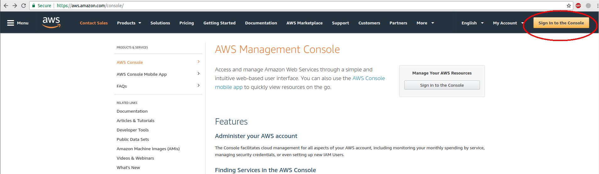
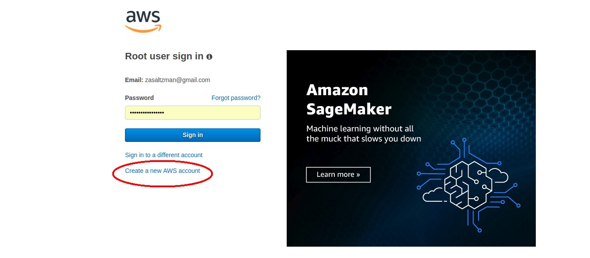
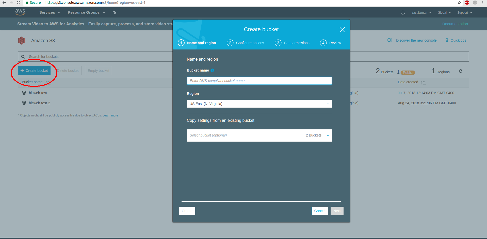

# Creating a New AWS Bucket

BioImageSuite Web is capable of reading files from a user's AWS Buckets, but configuring this properly requires a bit of setup. This document will explain the most efficient way to create an Amazon AWS account, set up your bucket, and configure it to work with BisWeb.

### Creating an AWS Account 

The first step to creating a bucket is to create an Amazon AWS account at [the following link](https://aws.amazon.com/console/). Click the 'Sign In to the Console' button at the top right then click 'Create a new AWS account' just below the blue 'Sign in' button. This will begin a tutorial that will guide you through the process of creating a new AWS Account. Bear in mind that this may require linking a credit card, though what BioImageSuite requires shouldn't surpass the free usage limits.

_Figure 1: The two screens you will see on your way to creating an AWS Account_

### Creating an S3 Bucket

Once you've created an AWS account, find S3 on the console's dashboard and click the link. 

_Figure 2: The AWS Console with the S3 button highlighted._

Once in the main S3 menu, click the 'Create bucket' button and follow the prompts to configure your bucket. Note that BioImageSuite does not currently support encrypted buckets, but this may change in a future release. 

_Figure 3: The 'Create Bucket' button and the prompt it will open._